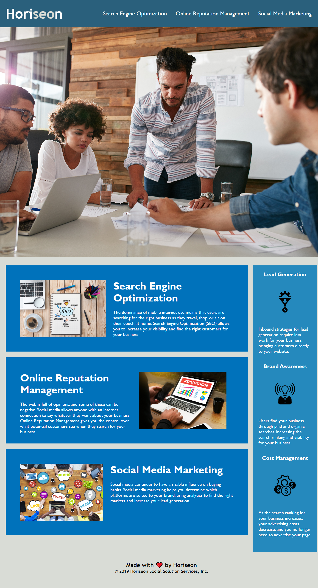

# <Challenge 1: Horiseon Accessibility Refactor>

## Description

In this project, a fictional company wanted their website refactored for search engine optimization and screen reader accessibility.
Completing this project involved implementing these refactors in addition to semantic language in both HTML and CSS.
It also featured opportunities to edit code for debugging and legibility purposes.
The finished product met parameters using code that was both simpler and more effective than the starting material.
In all, this project allowed me to demonstrate an understanding of HTML and CSS functionality and best practices.

## Usage

At time of publication, the project can be found deployed at https://dopalescent.github.io/Horiseon/

The following screenshot previews the deployed project:

## Credits

Penn LPS Boot Camp program for education and resources
MDN Web Docs for CSS Property references
Youssuf from AskBCS for information on CSS display property and screen reader interaction.
EdX and The Full-Stack Blog for their Professional README Guide article.